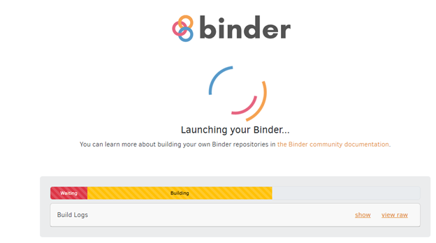
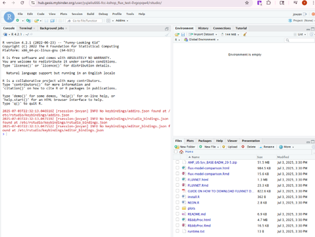
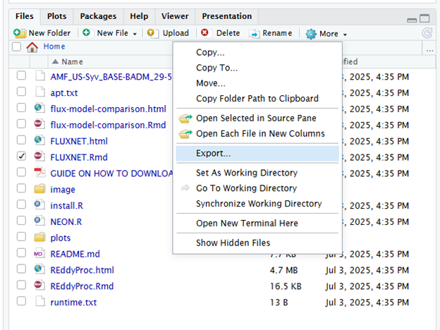

🤝 If there is any interest in testing or further contributions for the tutorials before end of July, please take a look at the checklist here: https://docs.google.com/document/d/1ko_-WazFPBJvMSIA_i455ifez3q5B459/edit?tab=t.0. Thanks!

👋 Welcome to the Bridging the Gap: Flux Data Meets Land Surface Models - Flux tutorials!

# Things to do before workshop 
- Create an account: https://amfcdn.lbl.gov/create
- Learn how to download FLUXNET data for `US-Ha1` or `BR-Sa1`, following `GUIDE ON HOW TO DOWNLOAD FLUXNET DATA PRODUCTS.pdf`
- Please download the GitHub repository shortly before the workshop; Install basic data manipulation and plotting packages on your computer (R users should have dplyr, tidyverse, ggplot2, ncdf4, data.table, and ggpubr. Python users should have pandas, numpy, netCDF4, matplotlib, seaborn, scipy)
- 🌸 (Important) Test if you can launch Binder by following the instructions below:

### 🔗 What is Binder?
[Binder](https://mybinder.org/) is an open-source service that makes GitHub repositories interactive.
With just one click, users can launch a virtual compute environment with all dependencies installed. It is especially useful for teaching, code demonstrations, and sharing reproducible research. 

**Please click on the badge below**:

Then you will see a virtual computing environment, as shown in the images below. Typically, it takes > 5 mins to launch. If it is still loading after 3 mins, please refresh the browser page.

🧪 Binder launches a temporary session (in a Docker container) based on GitHub repo, but:
- 📝 Any edits you make inside Binder (e.g., to code or files) exist only in that temporary environment
- ⏳ When the session ends, all changes are lost

💾 Luckily, you can save files with your edits manually from the Binder file browser:
1.	📁 In the Files pane (usually lower-right corner), navigate to the file or folder you want
2.	☑️ Check the box next to the file
3.	⚙️ Click the More button (gear icon), then select Export...
4.	⬇️ Your browser will download the selected file

💡 Please note: We will use Binder for Tutorial 1, as it takes > 20 mins to install `REddyProc`. For Tutorials 2 and 3, you may run the scripts either using Binder or locally on your own machine.

________________________________________
## 📚 Three tutorials are included here:
1. 📦 REddyProc workflow (day 1: 75 mins)
2. 🌐 FLUXNET data application (day 1: 75 mins)
3. 🔍 Flux model comparison (day 3: 60 mins)

# 📦 Tutorial 1: REddyProc workflow
### 🔗 What is REddyProc?
REddyProc is a R package about standard and extensible Eddy-Covariance data post-processing (Wutzler et al., 2018) includes u* filtering, gap-filling, and flux-partitioning.  
🌿 The Eddy-Covariance (EC) micrometeorological technique quantifies continuous exchange fluxes of gases, energy, and momentum between an ecosystem and the atmosphere.  
⚙️ It is important for understanding ecosystem dynamics and upscaling exchange fluxes (Aubinet et al., 2012).  

This package includes functions for post-processing half-hourly flux data:
- 1️⃣ A quality-check and filtering is performed based on the relationship between measured flux and friction velocity (uStar) to discard biased data (Papale et al., 2006).  
- 2️⃣ Gaps in the data are filled based on information from environmental conditions (Reichstein et al., 2005).  
- 3️⃣ The net flux of carbon dioxide is partitioned into its gross fluxes in and out of the ecosystem by night-time based and day-time based approaches (Lasslop et al., 2010).

### Where to download the package?
- 📦 [CRAN release of REddyProc](https://cran.r-project.org/web/packages/REddyProc/index.html)  
- 🚧 [Development version on GitHub](https://github.com/EarthyScience/REddyProc)  
- 🌐 [REddyProcWeb online tool](https://www.bgc-jena.mpg.de/5622399/REddyProc)
### 🎯 Tutorial outcomes
- Comprehension: flux postprocessing, including u* filtering, gap-filling and partitioning;
- Application: working on one typical workflow using REddyProc;

### 📘 Tutorial Guide
- Script: `01_REddyProc.rmd`;
- Data: AmeriFlux BASE data for `US-Syv`;
- We use data from `US-Syv` for demonstration. Please do not change to other sites if you are using REddyProc for the first time;
- If you have experience with this package, please try to explore 'Bonus training' suggested in the R script;
- If you want to use REddyProc for your own study sites, we have a helf session after the turtorial.
  
# 🌐 Tutorial 2: FLUXNET data application
### 🔗 What is FLUXNET?
- 📊 The [FLUXNET2015](https://fluxnet.org/data/fluxnet2015-dataset/) dataset includes data collected at sites from multiple regional flux networks. 
- 🚀 The [next generation](https://fluxnet.org/2024/09/17/announcing-the-fluxnet-data-system-initiative/) of global, open, and accessible FLUXNET data will be available soon.
### 🎯 Tutorial outcomes
- Comprehension: Understand FLUXNET data products (data structure, key variables, uncertainty, qualify flags, etc);
- Application: Work in groups to utilize FLUXNET data to understand your study site;
- Analysis: Explore temporal trends in meteorological and flux data for your study site; 

### 📘 Tutorial Guide
- Script: `02_FLUXNET.rmd`;
- Data for different study sites can be found in the data folder [here](https://drive.google.com/drive/folders/19XyadKuvngJOKJHWAuCEHk5Et7oZf5VI);
- In the R script, we provide examples to plot FLUXNET data for `US-Syv`. You can use the examples as a starting point, discuss with your group, and explore other ways of plotting to better understand your own study site;
- Required task (4 taskes): Explore temporal trends (long-term annual sums, daily average) for meteorological and flux data;
- Bonus task (3 tasks): **ecosystem water budget**, **light use efficiency**, and **energy balance closure**. Please explore 1–3 of them within your group.
- Please take time to interpret the figures with your group and include them in your [group presentation](https://drive.google.com/drive/folders/19XyadKuvngJOKJHWAuCEHk5Et7oZf5VI?usp=drive_link).

# 🔍 Tutorial 3: Comparing FLUXNET data and ELM output
### 🎯 Tutorial outcomes
- Comprehension: Time-series comparison of observed vs model data
- Application: Work in groups to utilize FLUXNET data and ELM outputs (default and adjusted runs)
- Analysis: Determine the level of agreement between flux tower data and ELM outputs across years with available data
  
### 📘 Tutorial Guide
- Script: `02_flux-model-comparison.rmd`;
- Data for different study sites can be found in the data folder [here](https://drive.google.com/drive/folders/19XyadKuvngJOKJHWAuCEHk5Et7oZf5VI)
- In this tutorial, we will compare the FLUXNET data with the ELM outputs. There are 10 overlapping variables that we can compare between the two data sets. Check the [crosswalk  table](https://docs.google.com/spreadsheets/d/12qbzWilQ1WBcUz0q1-D1wOT822uZzNirDPYTNFZSlWc/edit?usp=drive_link) for these variables, units, and conversion factors. 
- There are 4 parts to this tutorial. Parts 1 to 3 will create time-series graphs for comparing environmental variables, energy exchange variables, and carbon flux variables. In Part 4, we use a simple tool to discern the level of agreement between flux tower data and ELM output. 
  
---

# Other learning resources
### ⏳ Working with half-hourly data:  
- 📺 [Youtube: FLUXNET-ECN Workshop – Thomas Wutzler](https://www.youtube.com/watch?v=-b0vc4u8kls)
- ❓ [FAQ for REddyProc](https://www.bgc-jena.mpg.de/5629512/FAQ)
- 📚 [EGU 2019 Short Course Materials (REddyProc)](https://github.com/bgctw/EGU19EddyCourse/tree/master)
- 🐾 [Gapfilling flux data using a machine learning model](https://github.com/YujieLiu666/NEON_gapfill_test/tree/main)
- 🌫️ [Correcting RH-dependent water flux underestimation under high RH conditions](https://github.com/WJ714/HRHC_mpi_bgc)
### ⚡ Working with high-frequency data:
- 🔬 [EcoFlux Lab: High-Frequency Data Processing Documentation](https://ecoflux-lab.github.io/PipelineDocumentation/PipelineDocumentation.html)
  

# References
- 🔸 Wutzler et al., 2018: [https://doi.org/10.5194/bg-15-5015-2018](https://doi.org/10.5194/bg-15-5015-2018)  
- 🔸 Aubinet et al., 2012: [https://doi.org/10.1007/978-94-007-2351-1](https://doi.org/10.1007/978-94-007-2351-1)  
- 🔸 Papale et al., 2006: [https://doi.org/10.5194/bg-3-571-2006](https://doi.org/10.5194/bg-3-571-2006)  
- 🔸 Reichstein et al., 2005: [https://doi.org/10.1111/j.1365-2486.2005.001002.x](https://doi.org/10.1111/j.1365-2486.2005.001002.x) 
- 🔸 Lasslop et al., 2010: [https://doi.org/10.1111/j.1365-2486.2009.02041.x](https://doi.org/10.1111/j.1365-2486.2009.02041.x)
- 🔸 Liu et al., 2025: [https://doi.org/10.1016/j.agrformet.2025.110438](https://doi.org/10.1016/j.agrformet.2025.110438)

# Acknowledgement
- Andrew D. Richardson: critical suggestions for the analysis
- Thomas Wutzler: sharing knowledge about REddyProc
- Darby Bergl: sharing experience of building up binder

